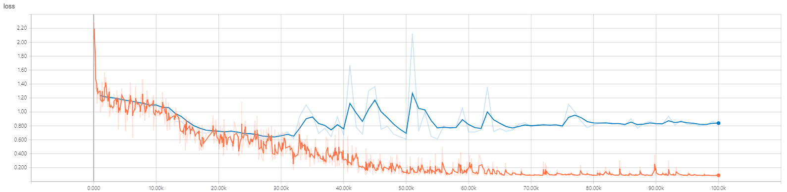

# Relation Networks in Tensorflow
Tensorflow Implementation of Relation Network

## Descriptions
The purpose of this project is aimed to understand Relation Network for my personal research. First of all, I'll implement **Relation Network** proposed in the paper [A Simple Neural Network Module for Relational Reasoning](https://arxiv.org/abs/1706.01427).

### Relation Network ?

------ About Relation Network ------

### Datasets ?

------ About Datasets ------

### Usage 

```bash
$ python soc_main.py --use_tpu=false --data_dir="The directory where the input datais stored" --model_dir="The direcrtory where the model summaries are stored" 
```

## Results

### Sort-of-CLEVR

RN model accuracy


RN model loss



Valdation

| | RN model |
| --- | --- |
| Ovarall Accuracy | **85%** |


### bAbI

------ ... ing ------
